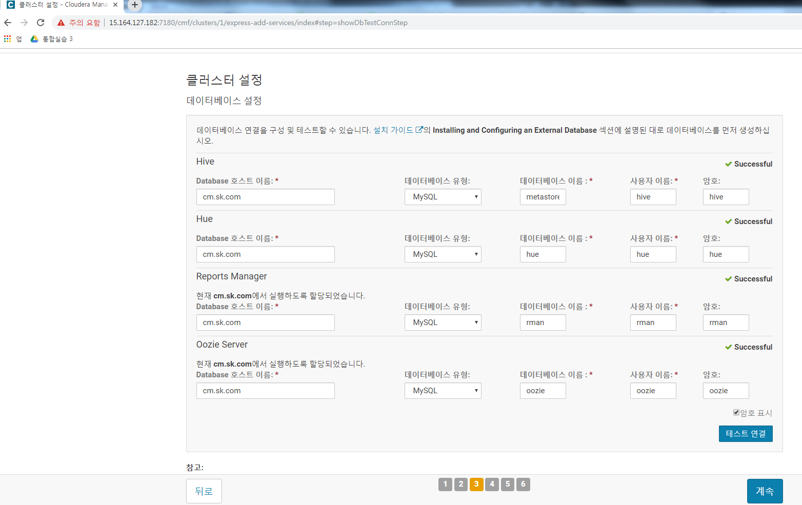

# Linux Setup

## 1. Add linux accounts (training)


## 2. List the your instances by IP address and DNS name


## 3. List the Linux release you are using


## 4. List the file system capacity for the first node (master node)


## 5. List the command and output for yum repolist enabled


## 6. List the /etc/passwd entries for training (only in master name node)
)


## 7. List the /etc/group entries for skcc (only in master name node)


## 8. List output of the flowing commands:
> ### getent group skcc
> ### getent passwd training
> 


### Linux 추가 설정 
> ```
> sed -i 's/^PermitRootLogin .*/PermitRootLogin yes/' /etc/ssh/sshd_config
> sed -i "s/^PasswordAuthentication .*/PasswordAuthentication yes/g" /etc/ssh/sshd_config
> sed -i "s/^ChallengeResponseAuthentication .*/ChallengeResponseAuthentication yes/g" /> etc/ssh/sshd_config
> ```

### host name 설정 (all nodes)
> ```
> hostnamectl set-hostname cm.sk.com
> ```

### SSH 설정 (on CM)
* ssh copy
> ```
> ssh-keygen -t rsa
> ssh-copy-id -i ~/.ssh/id_rsa.pub m1.sk.com
> ssh-copy-id -i ~/.ssh/id_rsa.pub d1.sk.com
> ssh-copy-id -i ~/.ssh/id_rsa.pub d2.sk.com
> ssh-copy-id -i ~/.ssh/id_rsa.pub d3.sk.com
> ```
* cm에서 다른 노드 접속
> 


# Install CDH 5.15.2

## Configure a repoistory for CM


baseurl에 5.15.2로 설정 


### Install JDK
```
[root@ip-172-31-34-250 ~]# yum -y install oracle-j2sdk1.7
Loaded plugins: fastestmirror
Loading mirror speeds from cached hostfile
 * base: mirror.kakao.com
 * extras: mirror.kakao.com
 * updates: mirror.kakao.com
Resolving Dependencies
--> Running transaction check
---> Package oracle-j2sdk1.7.x86_64 0:1.7.0+update67-1 will be installed
--> Finished Dependency Resolution

Dependencies Resolved

=================================================================================================================
 Package                     Arch               Version                       Repository                    Size
=================================================================================================================
Installing:
 oracle-j2sdk1.7             x86_64             1.7.0+update67-1              cloudera-manager             135 M

Transaction Summary
=================================================================================================================
Install  1 Package

Total download size: 135 M
Installed size: 279 M
Downloading packages:
oracle-j2sdk1.7-1.7.0+update67-1.x86_64.rpm                                               | 135 MB  00:00:03     
Running transaction check
Running transaction test
Transaction test succeeded
Running transaction
  Installing : oracle-j2sdk1.7-1.7.0+update67-1.x86_64                                                       1/1 
  Verifying  : oracle-j2sdk1.7-1.7.0+update67-1.x86_64                                                       1/1 

Installed:
  oracle-j2sdk1.7.x86_64 0:1.7.0+update67-1                                                                      

Complete!
```


## Install CM Server Package


### Modify Java Option
Xmx2G -> Xmx4G


## Install and configure mariadb 
* install mariadb 
* my.cnf 설정
> ```
> systemctl stop mariadb
> vi /etc/my.cnf
> ```
> 
* Start mariadb 

* Execute mysql_secure_installation 

* Install JDBC connector (all nodes)
> ```
> yum install wget
> wget https://cdn.mysql.com//Downloads/Connector-J/mysql-connector-java-5.1.47.tar.gz
> tar zxvf mysql-connector-java-5.1.47.tar.gz
> mkdir -p /usr/share/java/
> cd mysql-connector-java-5.1.47
> cp mysql-connector-java-5.1.47-bin.jar /usr/share/java/mysql-connector-java.jar
> ls /usr/share/java
> ```

### Create DB for Cloudera Software
```
$ mysql -u root -P
CREATE DATABASE scm DEFAULT CHARACTER SET UTF8 DEFAULT COLLATE utf8_general_ci;
GRANT ALL ON scm.* TO 'scm'@'%' IDENTIFIED BY 'scm';
CREATE DATABASE amon DEFAULT CHARACTER SET UTF8 DEFAULT COLLATE utf8_general_ci;
GRANT ALL ON amon.* TO 'amon'@'%' IDENTIFIED BY 'amon';
CREATE DATABASE rman DEFAULT CHARACTER SET UTF8 DEFAULT COLLATE utf8_general_ci;
GRANT ALL ON rman.* TO 'rman'@'%' IDENTIFIED BY 'rman';
CREATE DATABASE hue DEFAULT CHARACTER SET UTF8 DEFAULT COLLATE utf8_general_ci;
GRANT ALL ON hue.* TO 'hue'@'%' IDENTIFIED BY 'hue';
CREATE DATABASE metastore DEFAULT CHARACTER SET UTF8 DEFAULT COLLATE utf8_general_ci;
GRANT ALL ON metastore.* TO 'hive'@'%' IDENTIFIED BY 'hive';
CREATE DATABASE sentry DEFAULT CHARACTER SET UTF8 DEFAULT COLLATE utf8_general_ci;
GRANT ALL ON sentry.* TO 'sentry'@'%' IDENTIFIED BY 'sentry';
CREATE DATABASE oozie DEFAULT CHARACTER SET UTF8 DEFAULT COLLATE utf8_general_ci;
GRANT ALL ON oozie.* TO 'oozie'@'%' IDENTIFIED BY 'oozie';
```


## Set up the Cloudera Manager Database
Preparing the Cloudera Manager Server Database
```
/usr/share/cmf/schema/scm_prepare_database.sh mysql scm scm scm
/usr/share/cmf/schema/scm_prepare_database.sh mysql amon amon amon
/usr/share/cmf/schema/scm_prepare_database.sh mysql rman rman rman
/usr/share/cmf/schema/scm_prepare_database.sh mysql hue hue hue
/usr/share/cmf/schema/scm_prepare_database.sh mysql metastore hive hive
/usr/share/cmf/schema/scm_prepare_database.sh mysql sentry sentry sentry
/usr/share/cmf/schema/scm_prepare_database.sh mysql oozie oozie oozie
```


## Install CDH and Other Software

* log 확인 
> ```
> tail -f /var/log/cloudera-scm-server/cloudera-scm-server.log
> ```
> 


## DB 정보
* A command and output that shows the hostname of your database server
> ```
> MariaDB [(none)]> select @@hostname;
> +--------------+
> | @@hostname   |
> +--------------+
> | cm.sk.com    |
> +--------------+
> 1 row in set (0.00 sec)
> ```


* A command and output that reports the database server version
> ```
> MariaDB [(none)]> select version();
> +----------------+
> | version()      |
> +----------------+
> | 5.5.60-MariaDB |
> +----------------+
> 1 row in set (0.00 sec)
> ```

* A command and output that lists all the databases in the server


# Welcome to Cloudera Manager
http://${cm_public_ip}:7180으로 접속

* 첫 화면 
* 약관 동의 
* 배포 버전 선택 
* 5.15.2 버전 요약내용 확인 
* 호스트 지정 
* 레파지토리 선택 
* JDK설치 옵션 선택 
* 단일사용자모드 사용안함 
* SSH 로그인 정보 입력 
* Agent 설치 
* Parcel 설치 
* 호스트 검증 
* 설치할 서비스 선택 
* 역할 할당 사용자 지정  
* 데이터베이스 설정 
* 변경 내용 검토 
* 클러스터 설치 실행 
* 클러스터 설치 성공 화면 
* 설치된 클러스터 화면 
