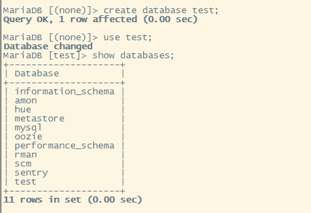
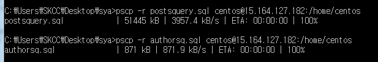
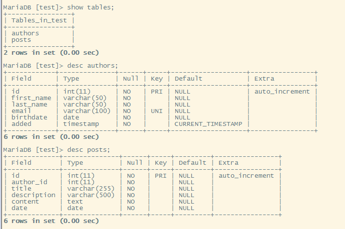
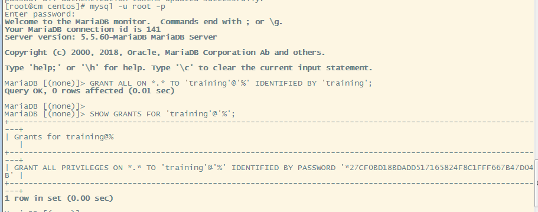

## In MySQL create the sample tables that will be used for the rest of the test 

## a. In MySQL, create a database and name it “test”


## b. Create 2 tables in the test databases: authors and posts.
i. You will use the authors.sql and posts.sql script files that will be provided for you to generate the necessary tables
### sql 파일 이동  

### SQL문 실행
 ```
 source postquery.sql
 source authorsq.sql
 ```
### 결과 


## c. Create and grant user “training” with password “training” full access to the test database. (It is ok if you give training full access to the entire MySQL database)
```
create user 'training'@'localhost' identified by 'training';
grant all privileges on *.* to 'training'@'%';
```
