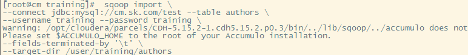
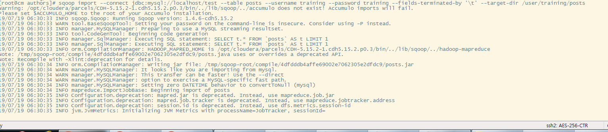
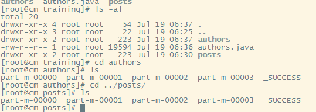

# Extract tables authors and posts from the database and create Hive tables. 


## Use Sqoop to import the data from authors and posts
```
sqoop import \
--connect jdbc:mysql://cm.sk.com/test --table authors \
--username training --password training \
--fields-terminated-by '\t' \
--target-dir /user/training/authors

[training@node1 ~] sqoop import \
--connect jdbc:mysql://sk.sk.com/test --table posts \
--username training --password training \
--fields-terminated-by '\t' \
--target-dir /user/training/posts
```



### 결과



## In Hive, create 2 tables: authors and posts. 
```
create external table default.authors
(id int,first_name string,last_name string,email string,birthdate date, added timestamp)
ROW FORMAT DELIMITED
FIELDS TERMINATED BY '\t'
STORED AS TEXTFILE
LOCATION '/user/training/authors';

create table default.posts
(id int, author_id int, title string, description string, content string, date date)
ROW FORMAT DELIMITED
FIELDS TERMINATED BY '\t'
STORED AS TEXTFILE
LOCATION '/user/training/posts';
```